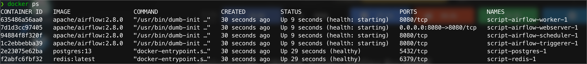

# airflow_tutorial
--- 

A tutorial for get start on Apache Airflow by [Serpsaipong Navanuraksa](https://github.com/funamorisenji)

In this repository, I will show you how to get start on Apache Airflow. I will use Docker to run Airflow and PostgreSQL. I will also show you how to create a simple DAG and run it.

First, you should understand the architecture of [Apache Airflow](https://airflow.apache.org/).

## Docker Compose 
--- 
I will use Docker Compose to run Airflow and PostgreSQL. You can see the `docker-compose.yaml` file in this [link](https://airflow.apache.org/docs/apache-airflow/stable/howto/docker-compose/index.html).

After you using `curl` to download the `docker-compose.yaml` file, you can run the following command to start Airflow and PostgreSQL.

```zsh
docker-compose up -d 
```

All the service should be start following. 



You can access web UI by using the following this [URL](http://localhost:8080/login/).


Please enter the username and password as `airflow` and `airflow` respectively.


_Note_: 
- You can see the example DAG in the web UI.
- You can turn off the example DAG by edit the `docker-compose.yaml` file. You can see the example DAG in the web UI.

```yaml
  airflow:
    image: ${AIRFLOW_IMAGE_NAME:-apache/airflow:2.1.2}
    environment:
      - AIRFLOW__CORE__LOAD_EXAMPLES=False
```


If you want to stop the service, you can run the following command.

```zsh
docker-compose down
```

## Known Issue
--- 
This is the known issue that I found when I try to run Airflow with Docker Compose (which I will try to fix it / update more issue later). 


### It's not working well with [Poetry](https://python-poetry.org/)
--- 


## Reference 
--- 
- [Apache Airflow](https://airflow.apache.org/)
- [Airflow Tutorial](https://airflow.apache.org/docs/apache-airflow/stable/tutorial.html)
- [Airflow Docker](https://airflow.apache.org/docs/apache-airflow/stable/start/docker.html)
- [Airflow Docker Compose](https://airflow.apache.org/docs/apache-airflow/stable/start/docker-compose.html)
- [Airflow GitHub](https://github.com/apache/airflow)
